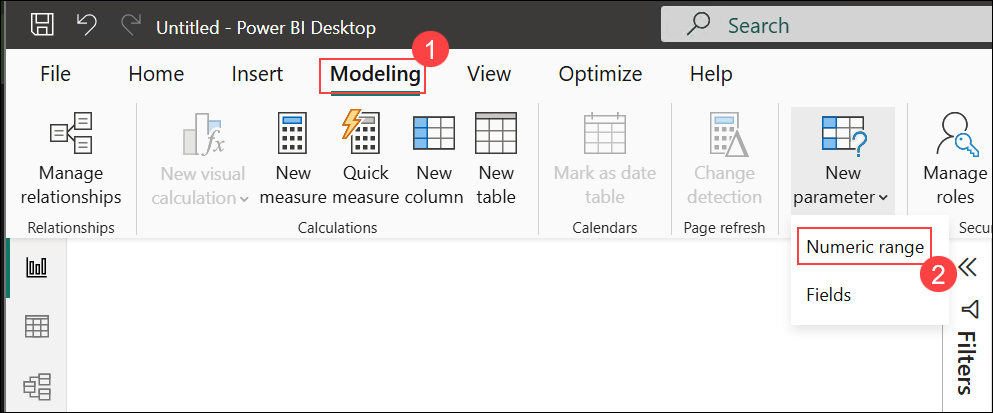

# Exercise 4: Build Executive Dashboard & Calculate ROI

### Estimated Duration: 15 Minutes

## Overview

In this exercise, you will create an executive-ready dashboard that combines adoption metrics from Exercise 2 and productivity improvements from Exercise 3 to calculate and present the return on investment (ROI) of GitHub Copilot. You'll build a comprehensive view that executives can use to make data-driven decisions about Copilot expansion and optimization.

## Objectives

You will be able to complete the following tasks:

- Task 1: Create ROI calculation measures using productivity improvements
- Task 2: Build an executive summary dashboard with key insights
- Task 3: Publish the dashboard to Power BI Service for sharing

## Prerequisites

- Completion of Exercise 2 (adoption metrics) and Exercise 3 (productivity impact analysis)
- Understanding of basic ROI calculation concepts
- Access to Power BI Service (provided in lab environment)

## Task 1: Create ROI Calculation Measures

In this task, you'll create measures that translate productivity improvements into financial value and calculate the ROI of Copilot investment.

### A. Time Savings Calculations

1. Click on (+) at the bottom tab area and select **New page**.

1. Rename the page to **Executive Dashboard**.

   


1. Right-click **pr_baseline** table → **New measure**. Create **Hours Saved per Developer per Month**:

   ```
   Hours Saved per Dev per Month = 
   VAR LeadTimeReduction = [Lead Time Improvement]
   VAR AvgPRsPerMonth = [Post-Copilot PRs Merged] 
   VAR HoursSaved = LeadTimeReduction * AvgPRsPerMonth
   RETURN HoursSaved
   ```

   

1. Right-click **pr_baseline** table → **New measure**. Create **Total Hours Saved Organization**:

   ```
   Total Hours Saved Organization = 
   [Hours Saved per Dev per Month] * [Active Users]
   ```

   

### B. Financial Value Calculations

1. Create **Developer Hourly Rate** parameter for ROI sensitivity analysis:
   
   Go to **Modeling** → **New parameter** → **Numeric range**:

   

   - Name: Developer Hourly Rate
   - Minimum: 50
   - Maximum: 200  
   - Increment: 10
   - Default: 75
   - Add slicer to page: Yes

      

1. Right-click **pr_baseline** table → **New measure**. Create **Monthly Time Savings Value**:

   ```
   Monthly Time Savings Value = 
   [Total Hours Saved Organization] * 'Developer Hourly Rate'[Developer Hourly Rate Value]
   ```

   

   Format as **Currency** with **0 decimal places**.

   > **Note**: Use the full table reference 'Developer Hourly Rate'[Developer Hourly Rate Value] to ensure proper parameter reference.

1. Right-click **pr_baseline** table → **New measure**. Create **Annual Time Savings Value**:

   ```
   Annual Time Savings Value = [Monthly Time Savings Value] * 12
   ```

   

### C. ROI Calculations

1. Create **Annual Copilot Cost** parameter:
   
   Go to **Modeling** → **New parameter** → **Numeric range**:

   

   - Name: Annual Copilot Cost per User
   - Minimum: 100
   - Maximum: 500
   - Increment: 20
   - Default: 228 (GitHub Copilot Business annual cost)
   - Add slicer to page: Yes

      

   > **Important**: After creating the parameter, you should see "Annual Copilot Cost per User Value" appear in your Data pane under the parameter section.

1. Right-click **pr_baseline** table → **New measure**. Create **Total Annual Copilot Investment**:

   ```
   Total Annual Copilot Investment = 
   [Active Users] * 'Annual Copilot Cost per User'[Annual Copilot Cost per User Value]
   ```

   

   > **Note**: Use the full table reference 'Annual Copilot Cost per User'[Annual Copilot Cost per User Value] to ensure proper parameter reference.

1. Right-click **pr_baseline** table → **New measure**. Create **Copilot ROI %**:

   ```
   Copilot ROI % = DIVIDE(
       [Annual Time Savings Value] - [Total Annual Copilot Investment],
       [Total Annual Copilot Investment],
       0
   )
   ```

   

   Format as **Percentage** with **0 decimal places**.

1. Right-click **pr_baseline** table → **New measure**. Create **ROI Payback Period (months)**:

   ```
   ROI Payback Period (months) = DIVIDE(
       [Total Annual Copilot Investment],
       [Monthly Time Savings Value],
       0
   )
   ```

   

   Format as **Decimal number** with **1 decimal place**.

1. **Verify Parameter Creation**: In the **Data** pane, you should see both parameters:
   - **Developer Hourly Rate** with "Developer Hourly Rate Value" underneath
   - **Annual Copilot Cost per User** with "Annual Copilot Cost per User Value" underneath

      

      

## Task 2: Build Executive Dashboard

In this task, you'll create a comprehensive executive dashboard that tells the complete Copilot story from adoption to ROI.

1. Insert **Card** visuals for the most important executive metrics:

   

   - **Copilot ROI %** (make this prominent with large font)

      

   - **ROI Payback Period (months)**
   - **Annual Time Savings Value**
   - **Active Users**

      

   > **Executive Value**: These 5 cards immediately communicate the business case for Copilot in terms executives understand.

### C. Create Adoption vs Impact Matrix

1. Insert a **Scatter chart** to show the relationship between adoption and productivity:

   

   - **X-axis**: Active Users (from copilot_org, by team)
   - **Y-axis**: Lead Time Improvement % (from Exercise 3)
   - **Size**: Annual Time Savings Value (by team)
   - **Legend**: team

      

   > **Executive Insight**: This shows which teams are both adopting Copilot well AND seeing productivity benefits, identifying success stories to replicate.

### D. Add Productivity Improvement Summary

1. Insert a **Clustered column chart** showing key improvements:

   - **X-axis**: Custom values ("Lead Time", "Cycle Time", "Throughput")
   - **Y-axis**: Improvement percentages

   

1. Interact and review the dashabord.

   

## Task 3: Publish to Power BI Service

In this task, you'll publish the dashboard to Power BI Service so it can be shared with executives and stakeholders.

1. In **Power BI Desktop**, select **File** → **Publish** → **Publish to Power BI**.

   

1. Choose **My workspace** and click **Select**.

   

1. When prompted to save changes, click **Save** and provide a meaningful filename like:
   `GitHub_Copilot_Executive_Dashboard.pbix`

   

1. After successful publish, click **Got it** to complete the process.

   


## Notes

- **ROI focuses on time savings** - the primary quantifiable benefit of Copilot for development teams
- **Use parameters** to make the dashboard adaptable to different organizations and scenarios
- **Separate technical details** from executive summary - executives need the "so what" not the "how"
- **Include payback period** - executives want to know when they'll see returns
- **Show team-level results** - helps identify where additional training or support might be needed
- **Consider additional benefits** like improved code quality, reduced bugs, and developer satisfaction in narrative

<validation step="ex4-validate-executive-dashboard" />

> **Validation Instructions**
> - Click the Validate button for this exercise in the lab environment UI.
> - Confirm ROI calculations show reasonable results and parameters work correctly
> - Verify the dashboard publishes successfully to Power BI Service
> - Check that all measures calculate without errors
> - If validation fails, verify that all prerequisite measures from Exercises 2-3 are available
> - For assistance email: cloudlabs-support@spektrasystems.com.

## Summary

In this exercise, you created a comprehensive executive dashboard that transforms Copilot usage data into clear business value metrics. You calculated ROI based on productivity improvements, created scenario analysis capabilities, and published the results to Power BI Service. This dashboard provides executives with the data-driven insights needed to make informed decisions about Copilot expansion and optimization across the organization.

### Congratulations! You have successfully completed the GitHub Copilot for Managers lab series. You now have the skills to measure, analyze, and communicate the business value of GitHub Copilot in your organization.
